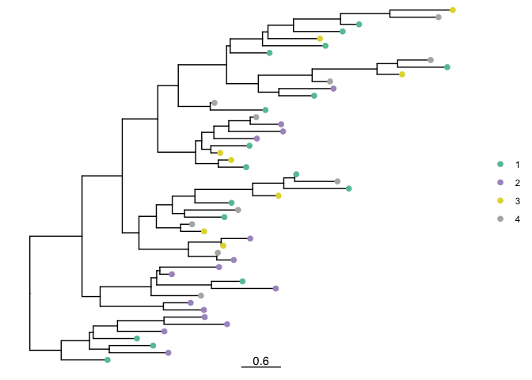
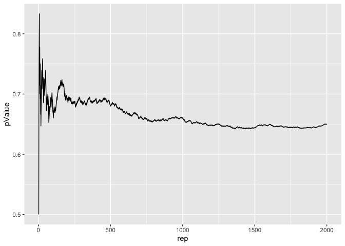
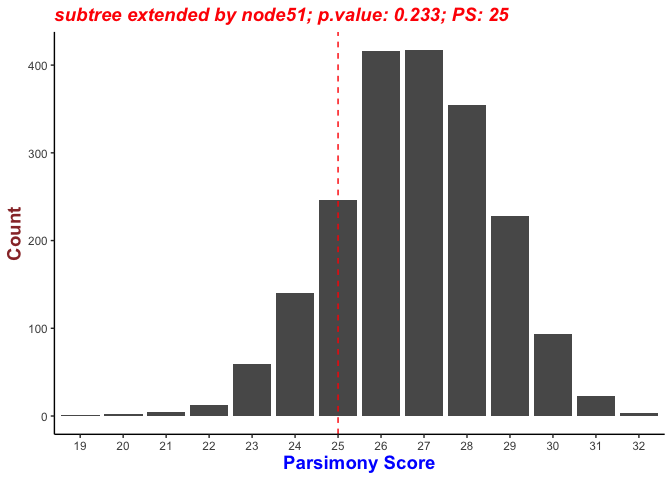

<!-- README.md is generated from README.Rmd. Please edit that file -->

# TTAT

<!-- badges: start -->
<!-- badges: end -->

Given a phylogenetic tree, we want to ask if more closely related taxa
are more likely to share the same trait values than we would expect by
chance. This R package provides analytical methods to decide if the
association between tips and characters is significant. By traversing
the whole tree, this package provides functions highlighting all the
subclades in which tips and characters are significantly associated.

## Installation

You can install the development version of TTAT from
[GitHub](https://github.com/) with:

``` r
# install.packages("devtools")
devtools::install_github("leke-lyu/TTAT")
```

## Features

`The Association Index (AI)` By measuring the imbalance of internal
phylogeny nodes, the AI statistic explicitly considers the shape of the
phylogeny.

`The Parsimony Score (PS)` We use Sankoff’s Algorithm to calculate the
parsimony score. Note that low PS scores represent robust
phylogeny–trait association.

`Traverse the Tree` The recursive function travels all the internal
nodes to deploy the test and to identify exciting subclades.

## Example

Load TTAT package

``` r
library(TTAT)
## basic example code
```

Generate rtree sample and assign traits on the tips

``` r
library(ape)
library(magrittr)

tree <- rtree(50)
data <- data.frame(tip=tree$tip.label, num=sample(1:4, 50, replace = T))
data[,2] %<>% as.character()

plotTreeWithTrait(tree, data)
```



Generate the null distribution and deploy the test

``` r
traverseTest(tree, data, "AI", 2000) %>% testSummary()
#> 7 tests have been deployed on the input tree with 50 tips using AI
#> ----------------------------------------------
#>                 root
#> Statistic    4.52569
#> Significance 0.64950
#> ----------------------------------------------
#>                node60   node74   node73   node72   node59   node58
#> Statistic    1.492369 1.289120 1.539152 2.424243 3.916612 4.227327
#> Significance 0.695500 0.969500 0.986000 0.936500 0.977500 0.796500
```



Present the null distribution

``` r
traverseTest(tree, data, "PS", 2000) %>% plotNullModel()
```



## Future steps

`Parallel Processing` To boost the speed when estimating the null
distribution.

`Extending the Choice of Metrics` the phylogenetic diversity (PD), the
net relatedness index (NRI), and nearest taxa index (NTI)
